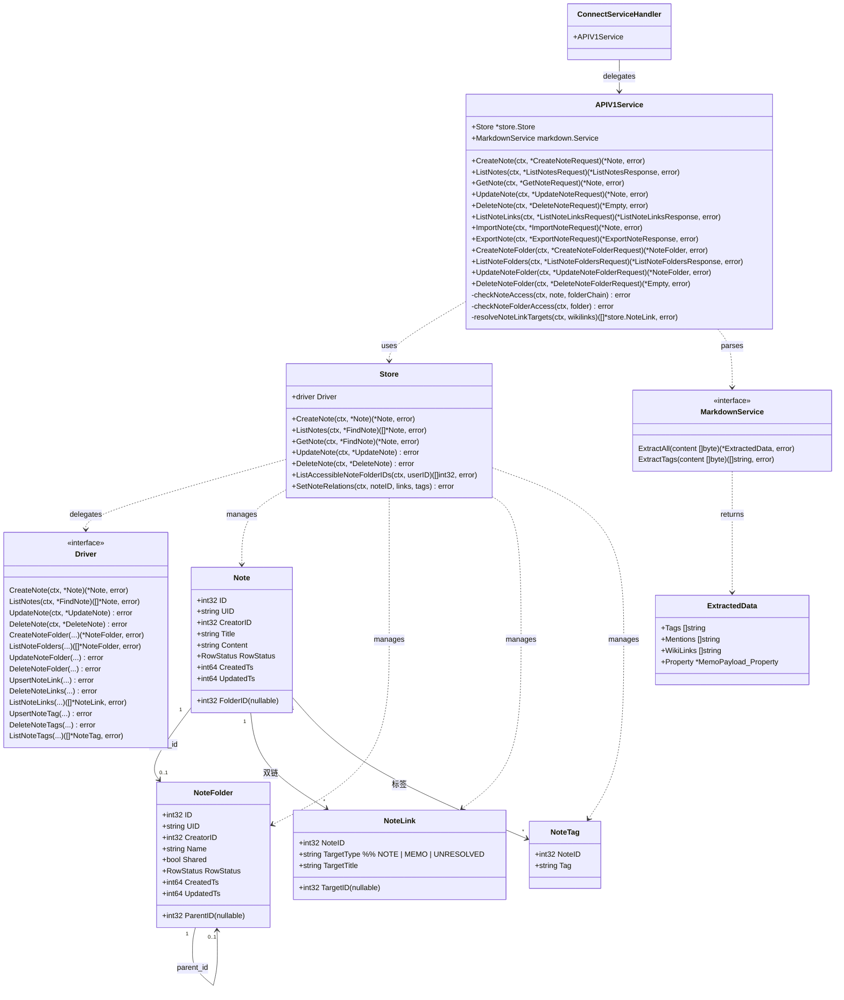
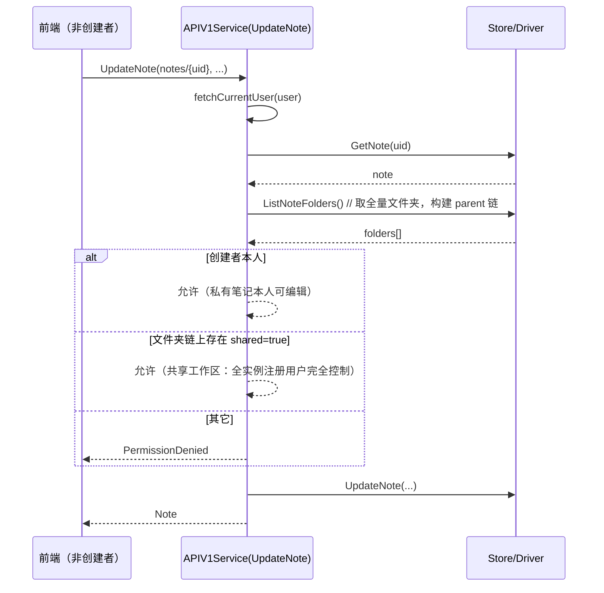
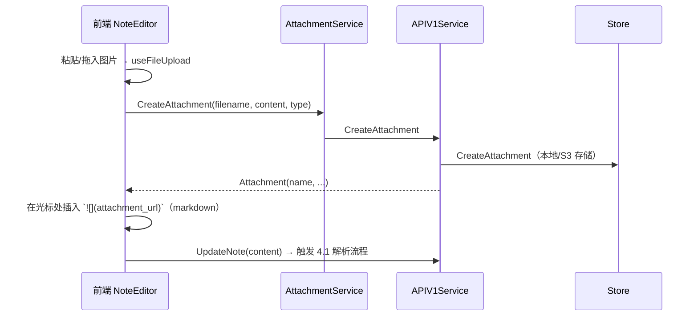
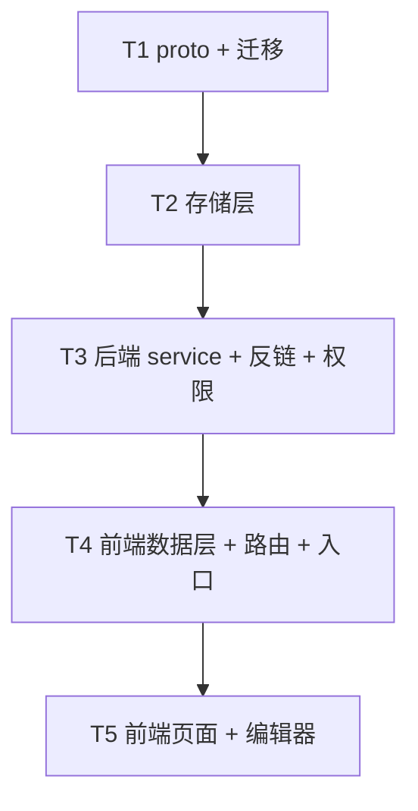

# 架构设计：Memos「笔记(Notes)」功能

> 架构师：高见远（Gao）
> 日期：2026-01
> 关联文档：`docs/notes/PRD.md`
> 目标仓库：`D:\Learning\job\github\memos`

---

## 0. 结论速览（TL;DR）

- **数据模型**：新增 4 张表 —— `note`（笔记）、`note_folder`（文件夹，`parent_id` 多层嵌套 + `shared` 共享标记）、`note_link`（双链关系，写入时解析入库）、`note_tag`（标签关系）。完全独立于 `memo` 表。
- **API**：新增独立 proto `note_service.proto`，内含 `NoteService` 与 `NoteFolderService` 两个 service；资源名前缀 `notes/{uid}`、`note_folders/{uid}`。
- **反链/标签**：在**写入时**用现有 goldmark markdown 服务抽取 `[[...]]` 与 `#tag`，按标题解析目标（笔记 + Memo），落库到 `note_link` / `note_tag`，搜索/反链走关系表查询。
- **编辑器**：复用现有 TipTap + `@tiptap/markdown`，新增 `WikiLink` mark 扩展 + 候选弹出；Live Preview 采用「光标块显示 Markdown 源码」的块级方案；只读渲染复用 `react-markdown` + 新增 `remark-wikilink` 插件。
- **权限**：服务端强制。私有 = 仅创建者；共享 = 沿 `parent_id` 向上存在任意 `shared=true` 文件夹 → 全实例注册用户完全控制。

---

## 1. 实现方案 + 框架选型

### 1.1 技术难点与选型依据

| 难点 | 选型 / 方案 | 理由 |
| --- | --- | --- |
| 独立数据实体 | 新增 `note` / `note_folder` 表 + 独立 `NoteService` / `NoteFolderService` | PRD 明确不复用 Memo；独立 API 避免污染备忘录语义 |
| Markdown 抽取（标签/双链） | 复用 `internal/markdown`（goldmark）现有 `TagExtension`，新增 `WikiLinkExtension` 内联 parser + `WikiLinkNode` | 与 `#tag`/`@mention` 完全同构，最小改动 |
| 双链目标解析 | 按标题解析：笔记查 `note.title`，Memo 查 `memo.payload` 内 `property.title`；未命中存 `UNRESOLVED` 悬空链接 | 写入时解析入库，反链查询 O(1) 走关系表，不实时扫描正文 |
| Live Preview 编辑器 | TipTap + 自定义「光标块源码」NodeView/插件 + 现有 `@tiptap/markdown` codec | 复用现有编辑器底座；块级源码显示接近 Obsidian，正文仍为纯 Markdown |
| 代码高亮 | 复用现有 `highlight.js`（`CodeBlock.tsx` 已按需注册语言） | 零新增依赖 |
| 图片内嵌 | 复用现有 `AttachmentService.CreateAttachment` + MemoEditor 的 `useFileUpload` 粘贴/拖拽流程 | 现有附件体系已含本地/S3 存储与缩略图 |
| 三驱动迁移 | `store/migration/{sqlite,mysql,postgres}/0.31/00__notes.sql` + 各 `LATEST.sql` | 遵循 AGENTS.md 版本子目录约定 |
| 权限模型 | `note_folder.shared` 沿 `parent_id` 向上继承；服务层 `checkNoteAccess` 统一校验 | 共享粒度=文件夹，子文件夹继承，符合 PRD 决策 |

### 1.2 数据模型（表结构草案）

> 约定：时间戳沿用仓库统一风格 —— SQLite 用 `BIGINT`（unix 秒），MySQL 用 `TIMESTAMP`，PostgreSQL 用 `BIGINT`（unix 秒）。`row_status` 沿用 `NORMAL/ARCHIVED`。

#### `note_folder`

| 列 | 类型（SQLite 示意） | 说明 |
| --- | --- | --- |
| `id` | INTEGER PK AUTOINCREMENT | 系统自增主键 |
| `uid` | TEXT UNIQUE NOT NULL | 对外资源 ID（shortuuid） |
| `creator_id` | INTEGER NOT NULL | 创建者 user.id |
| `parent_id` | INTEGER NULL | 父文件夹；NULL = 根级（用户“我的笔记”下） |
| `name` | TEXT NOT NULL | 文件夹名（允许为空视为根容器，实际不建根行） |
| `shared` | INTEGER NOT NULL DEFAULT 0 | 1 = 共享工作区 |
| `row_status` | TEXT NOT NULL DEFAULT 'NORMAL' | NORMAL / ARCHIVED |
| `created_ts` / `updated_ts` | BIGINT NOT NULL | unix 秒 |

- 索引：`idx_note_folder_creator_id (creator_id)`、`idx_note_folder_parent_id (parent_id)`。
- **共享继承**：不冗余存储。运行时沿 `parent_id` 向上找到任一 `shared=1` 即视为共享工作区。

#### `note`

| 列 | 类型 | 说明 |
| --- | --- | --- |
| `id` | INTEGER PK AUTOINCREMENT | 系统主键 |
| `uid` | TEXT UNIQUE NOT NULL | 对外资源 ID |
| `creator_id` | INTEGER NOT NULL | 创建者 |
| `folder_id` | INTEGER NULL | 所属文件夹；NULL = 根级（未归档私人根） |
| `title` | TEXT NOT NULL | 笔记标题（独立字段，与正文 H1 解耦） |
| `content` | TEXT NOT NULL DEFAULT '' | Markdown 源码；MySQL 用 MEDIUMTEXT，SQLite/PostgreSQL 用 TEXT |
| `row_status` | TEXT NOT NULL DEFAULT 'NORMAL' | NORMAL / ARCHIVED |
| `created_ts` / `updated_ts` | BIGINT NOT NULL | unix 秒 |

- 索引：`idx_note_folder_id (folder_id)`、`idx_note_creator_id (creator_id)`、`idx_note_title (title)`（搜索）。
- 笔记**不设** `visibility` 字段：可见性由所属文件夹链共享态派生（私有 = 默认）。

#### `note_link`（双链关系，写入时解析）

| 列 | 类型 | 说明 |
| --- | --- | --- |
| `note_id` | INTEGER NOT NULL | 源笔记 id |
| `target_type` | TEXT NOT NULL | `NOTE` / `MEMO` / `UNRESOLVED` |
| `target_id` | INTEGER NULL | 目标 id（NOTE→note.id；MEMO→memo.id；UNRESOLVED→NULL） |
| `target_title` | TEXT NOT NULL | 双链原文标题（如 `[[Go 笔记]]` → `Go 笔记`），悬空链接也保留 |
| `created_ts` | BIGINT NOT NULL | unix 秒 |

- 唯一键：`UNIQUE(note_id, target_type, target_id, target_title)`。
- 索引：`idx_note_link_target (target_type, target_id)`（反链查询）、`idx_note_link_note_id (note_id)`。

#### `note_tag`（标签关系）

| 列 | 类型 | 说明 |
| --- | --- | --- |
| `note_id` | INTEGER NOT NULL | 源笔记 id |
| `tag` | TEXT NOT NULL | 标签名（不含 `#`，保留原始大小写） |
| `created_ts` | BIGINT NOT NULL | unix 秒 |

- 唯一键：`UNIQUE(note_id, tag)`。
- 索引：`idx_note_tag_tag (tag)`（按标签过滤/反链）。

> 关系表在笔记**创建/更新时**整体重算（先删后插），保证与正文一致。

### 1.3 Proto service 定义草案

新增 `proto/api/v1/note_service.proto`（`package memos.api.v1`，`go_package gen/api/v1`），内含两个 service。资源命名遵循 AIP 资源模式。

```proto
// 资源名：
//   Note        -> notes/{uid}
//   NoteFolder  -> note_folders/{uid}

service NoteService {
  rpc CreateNote(CreateNoteRequest) returns (Note);            // POST /api/v1/notes
  rpc ListNotes(ListNotesRequest) returns (ListNotesResponse); // GET  /api/v1/notes  (标题模糊 + 标签过滤 + 文件夹过滤)
  rpc GetNote(GetNoteRequest) returns (Note);                  // GET  /api/v1/{name=notes/*}
  rpc UpdateNote(UpdateNoteRequest) returns (Note);            // PATCH /api/v1/{note.name=notes/*}
  rpc DeleteNote(DeleteNoteRequest) returns (google.protobuf.Empty); // DELETE /api/v1/{name=notes/*}
  rpc ListNoteLinks(ListNoteLinksRequest) returns (ListNoteLinksResponse); // GET /api/v1/{name=notes/*}/links?direction=OUT|IN
  rpc ExportNote(ExportNoteRequest) returns (ExportNoteResponse);   // GET  /api/v1/{name=notes/*}:export
  rpc ImportNote(ImportNoteRequest) returns (Note);                 // POST /api/v1/notes:import
}

service NoteFolderService {
  rpc CreateNoteFolder(CreateNoteFolderRequest) returns (NoteFolder); // POST /api/v1/note_folders
  rpc ListNoteFolders(ListNoteFoldersRequest) returns (ListNoteFoldersResponse); // GET /api/v1/note_folders
  rpc UpdateNoteFolder(UpdateNoteFolderRequest) returns (NoteFolder); // PATCH /api/v1/{note_folder.name=note_folders/*}
  rpc DeleteNoteFolder(DeleteNoteFolderRequest) returns (google.protobuf.Empty); // DELETE /api/v1/{name=note_folders/*}
}
```

关键 message 字段（草案，遵循 `field_behavior` 标注）：

- `Note`：`name`(1, IDENTIFIER)、`creator`(2, OUTPUT_ONLY, users/*)、`create_time`/`update_time`(3/4, OUTPUT_ONLY)、`title`(5, REQUIRED)、`content`(6, REQUIRED)、`folder`(7, OPTIONAL, note_folders/*)、`tags`(8, OUTPUT_ONLY, repeated string)、`links`(9, OUTPUT_ONLY, repeated NoteLink)、`backlinks`(10, OUTPUT_ONLY, repeated NoteLink)、`shared`(11, OUTPUT_ONLY, bool)。
- `NoteLink`：`target_type`(enum: NOTE/MEMO/UNRESOLVED)、`target`(资源名，OUTPUT_ONLY，可为空)、`title`(原文标题)。
- `NoteFolder`：`name`、`creator`、`create_time`/`update_time`、`parent`(optional, note_folders/*)、`title`、`shared`(bool)。
- `ListNotesRequest`：`page_size`/`page_token`/`filter`(CEL：`folder`、`creator`)/`title_search`(标题模糊)/`tag`(标签过滤)/`order_by`。
- `ImportNoteRequest`：`title` + `content`（Markdown 文本）+ `folder`；前端读文件后传文本，服务端做标题重名去重。
- `ExportNoteResponse`：`title` + `content`（前端拼 Blob 下载 `.md`）。

> 公开性：Notes 全部接口**默认需登录**（不加入 `PublicMethods`，`acl_config.go` 无需改动；仅需在 `v1.go`/`connect_handler.go`/`connect_services.go` 注册新 service）。

### 1.4 前端编辑器选型与双链扩展方案

- **编辑器底座**：复用 `web/src/components/MemoEditor/Editor/`（`extensions.ts`、`markdownCodec.ts`、`Tag.ts` 模式），新增：
  - `WikiLink.ts`：TipTap **Mark**（`code:true`，参照 `Tag.ts`），属性 `title` / `targetType` / `targetId`；`parseMarkdown`/`renderMarkdown` 保证 `[[title]]` 无损 round-trip；`renderHTML` 输出 `<span data-wikilink="title" data-target-type data-target-id>`。
  - `WikiLinkSuggestion.ts`：复用 `@tiptap/suggestion`（参照 `TagSuggestion.ts` / `SlashCommand.ts`），输入 `[[` 触发，候选来源 = 当前用户笔记标题 + Memo 标题（复用 `useMemoQueries` 的 title 提取）。
  - **Live Preview**：新增插件跟踪光标所在块；当前块的 NodeView 渲染该块的 Markdown 源码（由 `markdownCodec` 分块序列化得到），其余块正常渲染富文本。块级、点击即进入源码态。
- **只读渲染**：复用 `MemoContent/MemoMarkdownRenderer.tsx`，新增 `remark-wikilink` 插件（`web/src/utils/remark-plugins/remark-wikilink.ts`）将 `[[title]]` 转为 `span[data-wikilink]`；新增 `components/Notes/WikiLink.tsx` 按 `target_type` 渲染为可点击链接（跳 `/notes/:uid` 或 `/memos/:uid`）或悬空样式。
- **代码高亮**：直接复用 `CodeBlock.tsx`（highlight.js 已按需注册 go/python/ts 等）。

### 1.5 反链入库方案（写入时解析）

1. 保存时，服务层用 `internal/markdown`（新增 `WikiLinkExtension`）对 `content` 做一次 `ExtractAll`，得到 `tags[]` 与 `wikilinks[]`。
2. `ResolveNoteLinkTargets`：
   - 批量查 `note`：`title IN (...)`（限定可访问范围：`creator_id=当前用户` 或所在共享文件夹链）。
   - 批量查 `memo`：`payload->property.title IN (...)`（按当前用户可见范围 + PUBLIC）。
   - 命中 → `target_type=NOTE/MEMO` + `target_id`；未命中 → `UNRESOLVED` + `target_title` 保留原文。
3. 事务内（各 driver 用 `db.Begin()` 包裹）：`note` upsert 后，`DeleteNoteLinks/DeleteNoteTags` 再 `UpsertNoteLink/UpsertNoteTag`（全量重算）。
4. 反链查询 `ListNoteLinks(direction=IN)`：`note_link WHERE target_type='NOTE' AND target_id=?` 关联回源笔记；标签反链 `ListNotes(tag=...)`：`note_tag JOIN note`。

---

## 2. 文件列表及相对路径

> 【新建】= 新增文件；【修改】= 在现有文件追加/改动。生成物（`proto/gen/**`、`web/src/types/proto/**`）不手改，由 `buf generate` 产出。

### 2.1 后端 Go / proto / 迁移

| 路径 | 操作 | 说明 |
| --- | --- | --- |
| `proto/api/v1/note_service.proto` | 新建 | `NoteService` + `NoteFolderService` + 相关 message/enum |
| `internal/markdown/ast/wikilink.go` | 新建 | `WikiLinkNode` goldmark AST 节点 |
| `internal/markdown/parser/wikilink.go` | 新建 | `[[...]]` 内联 parser |
| `internal/markdown/extensions/wikilink.go` | 新建 | `WikiLinkExtension` |
| `internal/markdown/markdown.go` | 修改 | `ExtractedData` 增加 `WikiLinks []string`；`ExtractAll` 收集 wikilink；`NewService` 支持 `WithWikiLinkExtension` |
| `store/note.go` | 新建 | `Note` / `FindNote` / `UpdateNote` / `DeleteNote` + Store 门面方法 |
| `store/note_folder.go` | 新建 | `NoteFolder` / `FindNoteFolder` / `UpdateNoteFolder` / `DeleteNoteFolder` + Store 门面方法 |
| `store/note_link.go` | 新建 | `NoteLink` / `FindNoteLink` + upsert/delete/list |
| `store/note_tag.go` | 新建 | `NoteTag` / `FindNoteTag` + upsert/delete/list |
| `store/driver.go` | 修改 | Driver 接口新增 note/note_folder/note_link/note_tag 方法 |
| `store/db/sqlite/note.go` | 新建 | SQLite note CRUD |
| `store/db/sqlite/note_folder.go` | 新建 | SQLite folder CRUD |
| `store/db/sqlite/note_relation.go` | 新建 | SQLite link/tag 关系 CRUD |
| `store/db/mysql/note.go` | 新建 | MySQL note CRUD |
| `store/db/mysql/note_folder.go` | 新建 | MySQL folder CRUD |
| `store/db/mysql/note_relation.go` | 新建 | MySQL link/tag 关系 CRUD |
| `store/db/postgres/note.go` | 新建 | PostgreSQL note CRUD |
| `store/db/postgres/note_folder.go` | 新建 | PostgreSQL folder CRUD |
| `store/db/postgres/note_relation.go` | 新建 | PostgreSQL link/tag 关系 CRUD |
| `store/migration/sqlite/0.31/00__notes.sql` | 新建 | SQLite 增量迁移 |
| `store/migration/mysql/0.31/00__notes.sql` | 新建 | MySQL 增量迁移 |
| `store/migration/postgres/0.31/00__notes.sql` | 新建 | PostgreSQL 增量迁移 |
| `store/migration/sqlite/LATEST.sql` | 修改 | 追加 note 四表 |
| `store/migration/mysql/LATEST.sql` | 修改 | 追加 note 四表 |
| `store/migration/postgres/LATEST.sql` | 修改 | 追加 note 四表 |
| `server/router/api/v1/resource_name.go` | 修改 | 新增 `NoteNamePrefix` / `NoteFolderNamePrefix` + 抽取/构造 helper |
| `server/router/api/v1/note_service.go` | 新建 | NoteService 实现（CRUD/搜索/links/import/export + 权限） |
| `server/router/api/v1/note_folder_service.go` | 新建 | NoteFolderService 实现 |
| `server/router/api/v1/note_service_converter.go` | 新建 | store↔proto 转换、wikilink 目标解析、共享态判定 |
| `server/router/api/v1/connect_services.go` | 修改 | 追加 NoteService/NoteFolderService 的 Connect 委托 |
| `server/router/api/v1/connect_handler.go` | 修改 | `RegisterConnectHandlers` 注册新 service |
| `server/router/api/v1/v1.go` | 修改 | `APIV1Service` 嵌入 `Unimplemented*Server`；`NewAPIV1Service` 开启 WikiLink 扩展；`RegisterGateway` 注册两个 service |

### 2.2 前端 tsx/ts

| 路径 | 操作 | 说明 |
| --- | --- | --- |
| `web/src/connect.ts` | 修改 | 导出 `noteServiceClient` / `noteFolderServiceClient` |
| `web/src/helpers/resource-names.ts` | 修改 | 新增 `noteNamePrefix` / `noteFolderNamePrefix` + `extractNoteIdFromName` |
| `web/src/router/routes.ts` | 修改 | 新增 `NOTES: "/notes"` |
| `web/src/router/index.tsx` | 修改 | 懒加载注册 `Notes` / `NoteDetail` 路由（`RequireAuthRoute` 内） |
| `web/src/components/Navigation.tsx` | 修改 | 登录态 `primaryNavLinks` 插入「笔记」入口（`FileTextIcon`，紧随备忘录/发现后） |
| `web/src/hooks/useNoteQueries.ts` | 新建 | React Query hooks：`useNotes/useNote/useCreateNote/useUpdateNote/useDeleteNote/useNoteLinks/useExportNote/useImportNote` + `noteKeys` |
| `web/src/hooks/useNoteFolderQueries.ts` | 新建 | `useNoteFolders/useCreateNoteFolder/useUpdateNoteFolder/useDeleteNoteFolder` + `noteFolderKeys` |
| `web/src/hooks/index.ts` | 修改 | 导出新 hooks |
| `web/src/pages/Notes.tsx` | 新建 | 笔记列表页（文件夹树 + 笔记列表 + 搜索框） |
| `web/src/pages/NoteDetail.tsx` | 新建 | 笔记编辑页（标题 + Live Preview 编辑器 + 导出/更多菜单） |
| `web/src/components/Notes/NoteFolderTree.tsx` | 新建 | 多层嵌套文件夹树（折叠/右键菜单/共享标识 🔗） |
| `web/src/components/Notes/NoteListItem.tsx` | 新建 | 笔记列表项 |
| `web/src/components/Notes/NoteSearchBar.tsx` | 新建 | 标题模糊 + 标签过滤搜索 |
| `web/src/components/Notes/NoteEditor/index.tsx` | 新建 | 笔记编辑器容器（自动保存/图片上传/导入导出） |
| `web/src/components/Notes/NoteEditor/LivePreview.tsx` | 新建 | Live Preview 光标块源码插件/NodeView |
| `web/src/components/Notes/NoteEditor/WikiLink.ts` | 新建 | TipTap WikiLink Mark 扩展 |
| `web/src/components/Notes/NoteEditor/WikiLinkSuggestion.ts` | 新建 | `[[` 候选弹出（笔记 + Memo） |
| `web/src/components/Notes/WikiLink.tsx` | 新建 | 只读渲染 WikiLink 组件（跳转/悬空） |
| `web/src/utils/remark-plugins/remark-wikilink.ts` | 新建 | react-markdown 的 `[[...]]` 解析插件 |
| `web/src/types/markdown.ts` | 修改 | 新增 `WikiLinkNode` 类型与 `isWikiLinkElement` |
| `web/src/locales/zh-Hans.json` / `en.json` | 修改 | 新增笔记相关 i18n 文案（其它语言可选后续补） |

---

## 3. 数据结构与接口（Mermaid classDiagram）



---

## 4. 程序调用流程（Mermaid sequenceDiagram）

### 4.1 保存笔记 → 触发双链/标签解析入库

```mermaid
sequenceDiagram
    participant FE as 前端 NoteEditor
    participant SVC as APIV1Service(UpdateNote)
    participant MD as MarkdownService
    participant ST as Store/Driver
    participant DB as SQL(note_link/note_tag)

    FE->>SVC: UpdateNote(note.name, title, content, update_mask)
    SVC->>SVC: fetchCurrentUser + checkNoteAccess(note)
    SVC->>MD: ExtractAll(content)  // goldmark 一次解析
    MD-->>SVC: {tags:[...], wikilinks:[[...]]}
    SVC->>SVC: resolveNoteLinkTargets(wikilinks)
    SVC->>ST: ListNotes(title IN wikilinks)   // 解析到 note
    SVC->>ST: ListMemos(payload.title IN ...) // 解析到 memo
    ST-->>SVC: 目标 id 列表（未命中→UNRESOLVED）
    SVC->>ST: SetNoteRelations(noteID, links, tags)  // 事务：删旧+插新
    ST->>DB: BEGIN; DELETE note_link/note_tag; INSERT ...; COMMIT
    SVC->>SVC: convertNoteFromStore → 组装 Note（含 tags/links）
    SVC-->>FE: Note（保存成功，含解析结果）
```

### 4.2 共享文件夹权限校验（跨用户编辑）



### 4.3 图片粘贴/拖入上传并内嵌（复用 Attachment）



---

## 5. 任务列表（有序，含依赖）

> 分层：**T1 proto+迁移 → T2 存储层 → T3 后端服务 → T4 前端数据/路由/入口 → T5 前端页面与编辑器**。粒度适合工程师逐项落地。

### T1 — proto 定义 + 三驱动迁移（数据契约与表结构）

- **涉及文件**：
  - 新建 `proto/api/v1/note_service.proto`
  - 新建 `store/migration/{sqlite,mysql,postgres}/0.31/00__notes.sql`
  - 修改 `store/migration/{sqlite,mysql,postgres}/LATEST.sql`
- **产出物**：`buf generate` 通过；三个驱动增量迁移 + LATEST 等价；`go test -v ./store/...`（迁移测试）通过。
- **依赖**：无。
- **说明**：迁移版本号取 `0.31`（当前最新 `0.30`）。

### T2 — 存储层（store 门面 + 三驱动 CRUD）

- **涉及文件**：
  - 新建 `store/note.go` / `store/note_folder.go` / `store/note_link.go` / `store/note_tag.go`
  - 修改 `store/driver.go`
  - 新建 `store/db/{sqlite,mysql,postgres}/note.go`、`note_folder.go`、`note_relation.go`
  - 可选新增 `store/test/note_test.go`（TestContainers）
- **产出物**：三驱动 `CreateNote/ListNotes/UpdateNote/DeleteNote`、folder CRUD、`SetNoteRelations`（事务重算）、`ListAccessibleNoteFolderIDs` 可用；单测通过。
- **依赖**：T1。

### T3 — 后端 service + 反链解析 + 权限（含 markdown 扩展）

- **涉及文件**：
  - 新建 `internal/markdown/ast/wikilink.go`、`internal/markdown/parser/wikilink.go`、`internal/markdown/extensions/wikilink.go`
  - 修改 `internal/markdown/markdown.go`
  - 新建 `server/router/api/v1/note_service.go`、`note_folder_service.go`、`note_service_converter.go`
  - 修改 `server/router/api/v1/resource_name.go`、`connect_services.go`、`connect_handler.go`、`v1.go`
- **产出物**：`NoteService`/`NoteFolderService` 全 RPC 实现；`[[...]]` 写入时解析入库；私有/共享权限服务端强制；`go test -v -race ./server/...` 通过。
- **依赖**：T2。
- **说明**：`acl_config.go` **无需**改（全部接口默认登录）；在 `v1.go` 的 `NewAPIV1Service` 给 markdown 服务加 `WithWikiLinkExtension()`。

### T4 — 前端数据层 + 路由 + 侧边栏入口

- **涉及文件**：
  - 修改 `web/src/connect.ts`、`web/src/helpers/resource-names.ts`、`web/src/router/routes.ts`、`web/src/router/index.tsx`、`web/src/components/Navigation.tsx`
  - 新建 `web/src/hooks/useNoteQueries.ts`、`web/src/hooks/useNoteFolderQueries.ts`
  - 修改 `web/src/hooks/index.ts`、`web/src/locales/zh-Hans.json`、`en.json`
- **产出物**：侧边栏「笔记」入口（登录态，`FileTextIcon`）；`/notes` 路由；React Query hooks 就绪；`pnpm lint` 通过。
- **依赖**：T3（依赖生成的 TS proto 类型）。

### T5 — 前端页面 + 编辑器（Live Preview / 双链 / 图片 / 导入导出）

- **涉及文件**：
  - 新建 `web/src/pages/Notes.tsx`、`NoteDetail.tsx`
  - 新建 `web/src/components/Notes/NoteFolderTree.tsx`、`NoteListItem.tsx`、`NoteSearchBar.tsx`
  - 新建 `web/src/components/Notes/NoteEditor/index.tsx`、`LivePreview.tsx`、`WikiLink.ts`、`WikiLinkSuggestion.ts`
  - 新建 `web/src/components/Notes/WikiLink.tsx`、`web/src/utils/remark-plugins/remark-wikilink.ts`
  - 修改 `web/src/types/markdown.ts`
- **产出物**：笔记列表页（文件夹树/搜索/新建/移动/删除）+ 编辑页（Live Preview、`[[` 候选、`#tag`、图片上传内嵌、导出）；`pnpm lint && pnpm test` 通过。
- **依赖**：T4。

### 任务依赖图



---

## 6. 依赖包列表

> 原则：**尽量复用现有依赖，零新增重型依赖**。

| 依赖 | 用途 | 是否新增 |
| --- | --- | --- |
| 后端 `github.com/yuin/goldmark`（已有） | `[[...]]` wikilink 内联解析 | 否 |
| 后端 `github.com/lithammer/shortuuid/v4`（已有） | note/folder UID | 否 |
| 前端 `@tiptap/markdown`、`@tiptap/suggestion`、`marked`（已有） | WikiLink Mark + 候选 + round-trip | 否 |
| 前端 `react-markdown` + `remark-gfm` + `unist-util-visit`（已有） | 只读渲染 + `remark-wikilink` 插件 | 否 |
| 前端 `highlight.js`（已有） | 代码高亮 | 否 |
| 前端 `lucide-react`（已有） | `FileTextIcon` 等图标 | 否 |
| 前端 `fuse.js`（已有，可选） | 标题模糊搜索（前端即时过滤；服务端已用 `title_search`） | 否 |

**无需新增任何第三方依赖。** 双链解析、反链入库、Live Preview 均基于仓库现有技术栈实现。

---

## 7. 共享知识（跨文件约定）

- **ID 类型**：对外资源名用 `uid`（shortuuid，`base.UIDMatcher` 校验）；库内主键用 `int32`；时间戳用 `int64` unix 秒（SQLite/PostgreSQL 存 BIGINT，MySQL 存 TIMESTAMP）。
- **资源名**：Note `notes/{uid}`、NoteFolder `note_folders/{uid}`；前缀常量加在 `resource_name.go` 与前端 `helpers/resource-names.ts`，抽取用 `GetNameParentTokens`。
- **可见性/共享语义**：笔记无独立 `visibility` 字段；「共享」= 沿 `note_folder.parent_id` 向上存在 `shared=true`。私有=仅 `creator_id`；共享=全实例注册用户完全控制（读/写/删）。服务端 `checkNoteAccess` 统一校验，前端仅做体验层控制。
- **双链解析规则**：`[[title]]` 内联语法；目标按标题解析（笔记优先 `note.title`，Memo 用 `memo.payload.property.title`）；未命中 → `note_link.target_type='UNRESOLVED'`（保留 `target_title`）；写入时全量重算（先删后插，事务内）。
- **标签规则**：`#tag` 复用现有 goldmark TagExtension 与前端 Tag 规则（Unicode 字母/数字/符号 + `_-/&`，≤100 字符，链接/图片内不识别）。
- **目录路径约定**：迁移版本 `store/migration/{sqlite,mysql,postgres}/0.31/00__notes.sql`；后端 service 文件 `server/router/api/v1/note_service.go`；前端页面 `web/src/pages/Notes.tsx`、组件 `web/src/components/Notes/**`、hooks `web/src/hooks/useNoteQueries.ts`。
- **错误处理**：Go 用 `errors.Wrap`（`github.com/pkg/errors`）+ `status.Errorf(codes.X, "msg")`；未授权 `PermissionDenied`、不存在 `NotFound`、重名/唯一冲突 `AlreadyExists`。
- **proto 流程**：只改 `.proto` → `cd proto && buf generate && buf lint`；不手改 `proto/gen/**` 与 `web/src/types/proto/**`。
- **React Query**：服务端数据走 hooks（`useNoteQueries.ts`/`useNoteFolderQueries.ts`，`noteKeys`/`noteFolderKeys` 工厂）；UI 状态（文件夹展开、选中笔记、搜索词）放组件 state 或 context。
- **自动保存**：复用现有 MemoEditor 的 `useAutoSave` 防抖 + localStorage 草稿（`cacheService`）；首版不做并发冲突检测。
- **导入导出**：导出返回 `{title, content}`，前端拼 Blob 下载 `.md`；导入前端读文件传文本，服务端按「标题重名自动加序号 `(1)`」去重。

---

## 8. 待明确事项（风险/开放点）

1. **Live Preview 的保真度**：块级「光标块显示源码」在 TipTap/ProseMirror 下需要自定义 NodeView 做块级源码渲染，边界情况（代码块、表格、任务列表内的行）需在实现时重点打磨；若时间受限可先退化为「行级」源码显示。
2. **Memo 双链按标题解析的歧义**：Memo 标题来自首个 H1（`payload.property.title`），可能重名或缺失；解析命中多目标时需约定「取最近/创作者优先」，否则 `[[memo]]` 可能指向错误 Memo。建议 MVP 阶段：重名时按 `created_ts` 最新者解析，并在 UI 保留 `UNRESOLVED` 兜底。
3. **共享工作区的删除/级联语义**：删除共享文件夹是否级联删除其下笔记、移动笔记出共享区后权限是否即时回收、子文件夹 `shared` 与父文件夹不一致时的优先级，PRD 已定「子继承父」，但「删除共享文件夹需二次确认 + 级联处理」的交互细节由工程师与产品对齐。
4. **图片导出的资产完整性**：`.md` 导出目前只含 Markdown 文本与附件 URL；「含图片资源一起导出（打包附件）」属 PRD P2 之外，需确认是否纳入。
5. **全文搜索（P2-2）不在本版**：搜索仅「标题模糊 + 标签 + 反链」，正文全文检索（FTS/向量）未纳入；`note.content` 已可承载 ≥1MB，但全文搜索需另立方案。
6. **并发/自动保存**：首版无并发冲突检测（PRD 已明确）；多用户同时编辑共享笔记存在「后写覆盖」风险，作为已知限制记录。

---

## 附：与 AGENTS.md 的合规检查

- ✅ proto 变更只改 `.proto` → `buf generate`（T1）。
- ✅ 表结构三驱动迁移 + `LATEST.sql`（T1/T2）。
- ✅ 公开 API 端点需加到 `acl_config.go` —— 本功能**全部端点默认鉴权**，故**不新增** PublicMethods（无改动）。
- ✅ 服务端数据走 React Query hooks；UI 状态走 context/组件 state。
- ✅ 复用 `memos-api-endpoint` skill 的工作流（proto → service → Connect handler → hook）。
